### marvelcomics

#### Started Page,Favorite page

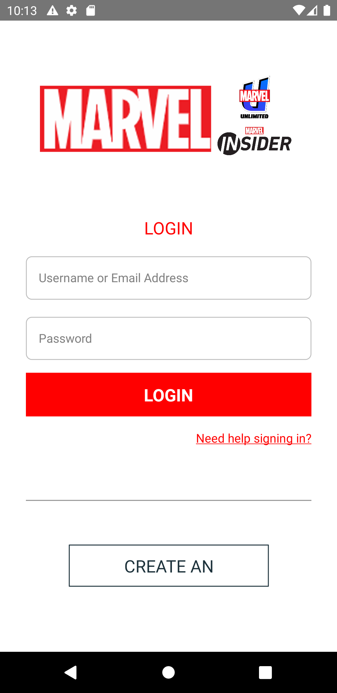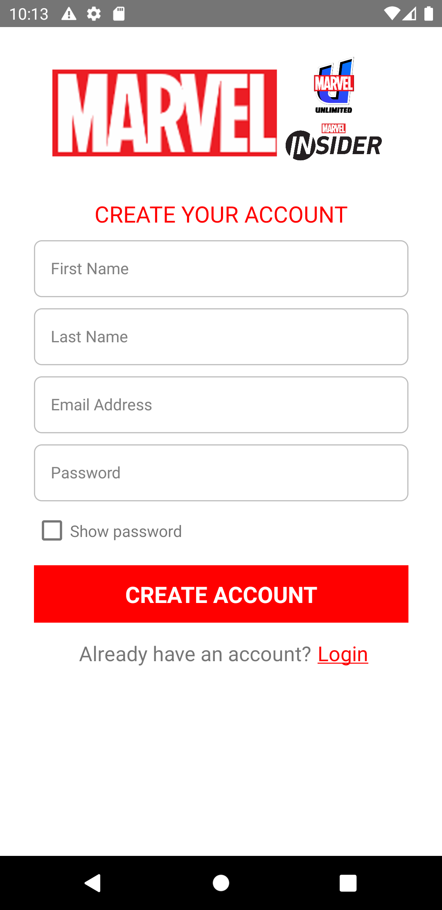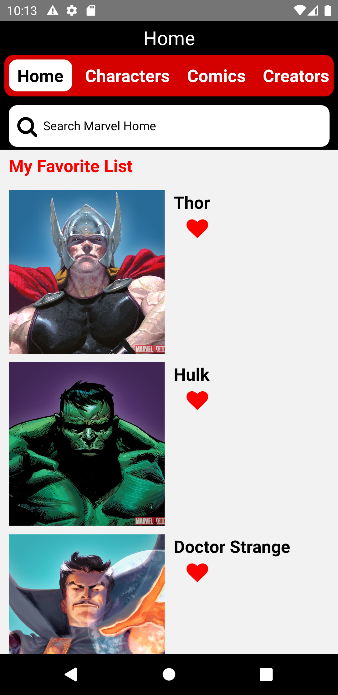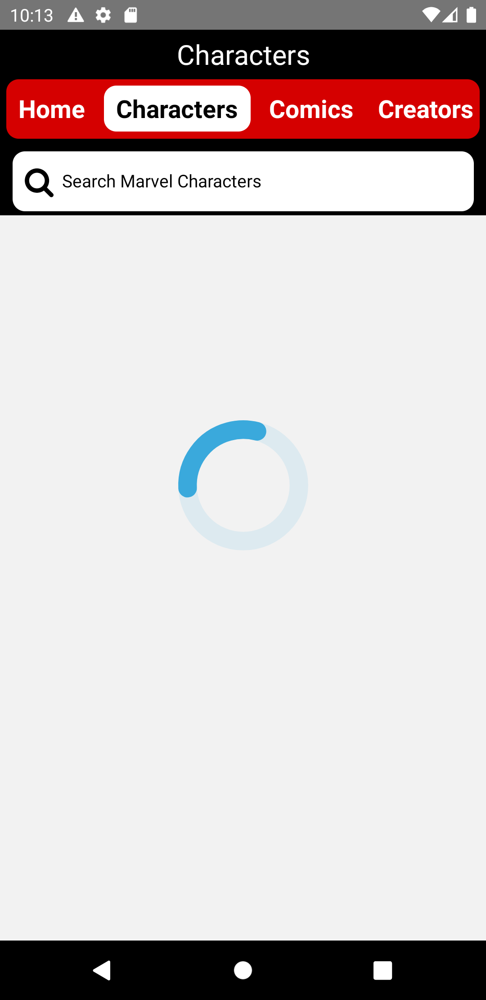

#### Characters Page

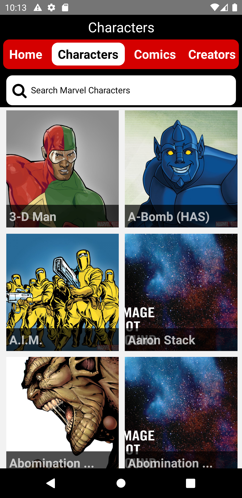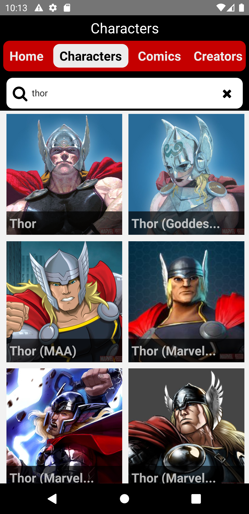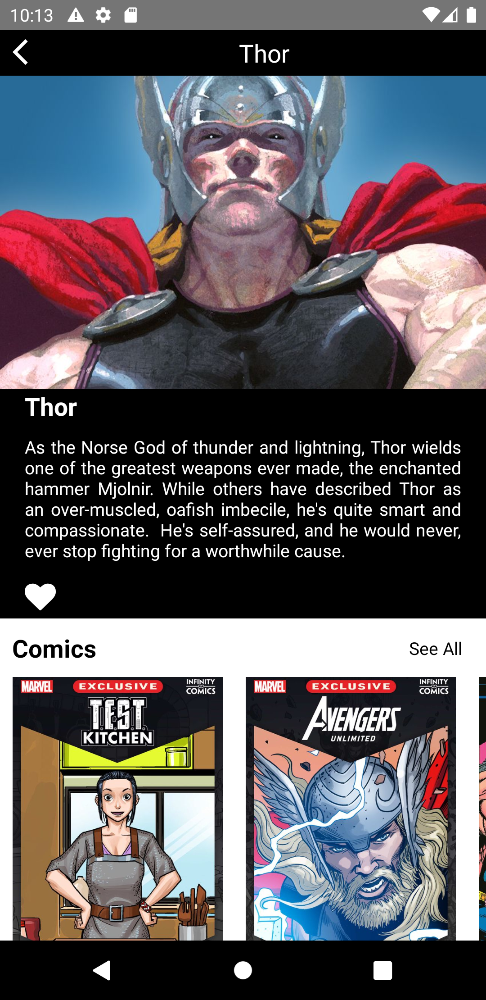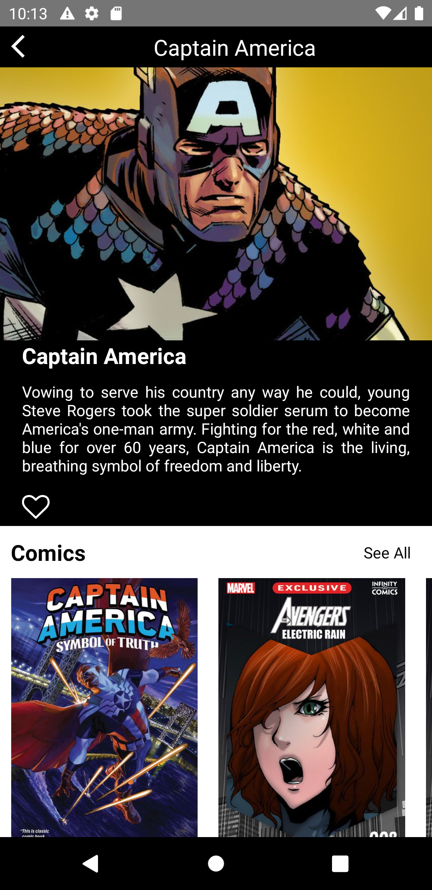 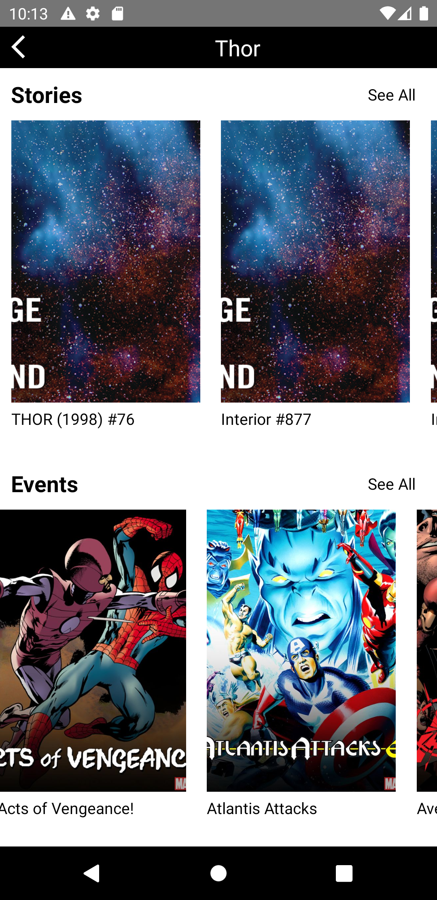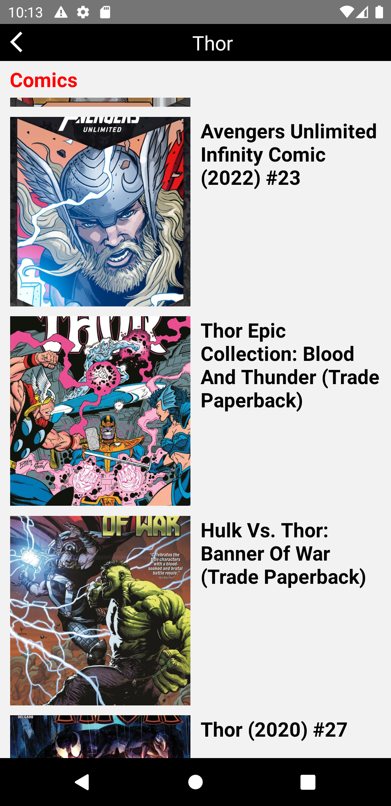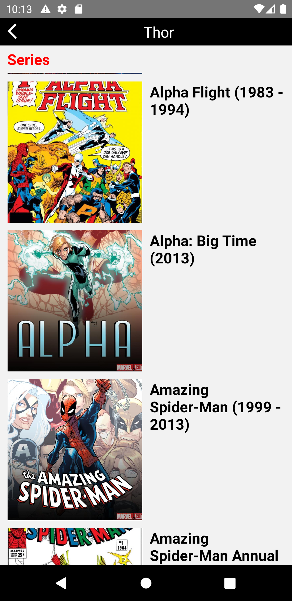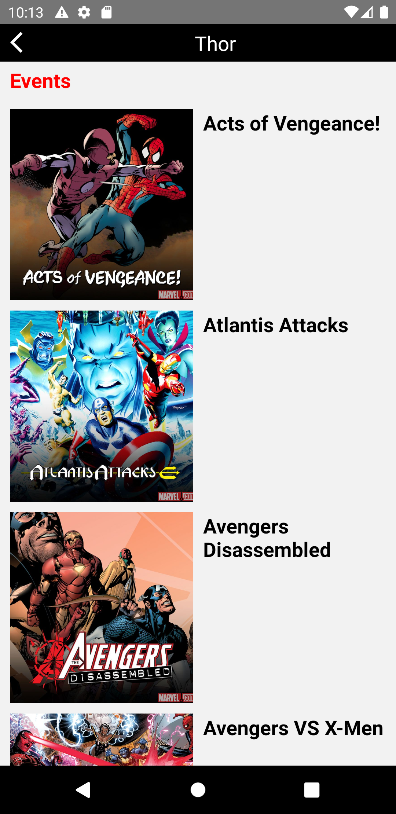

#### Comics Page,Events Page,Series Page

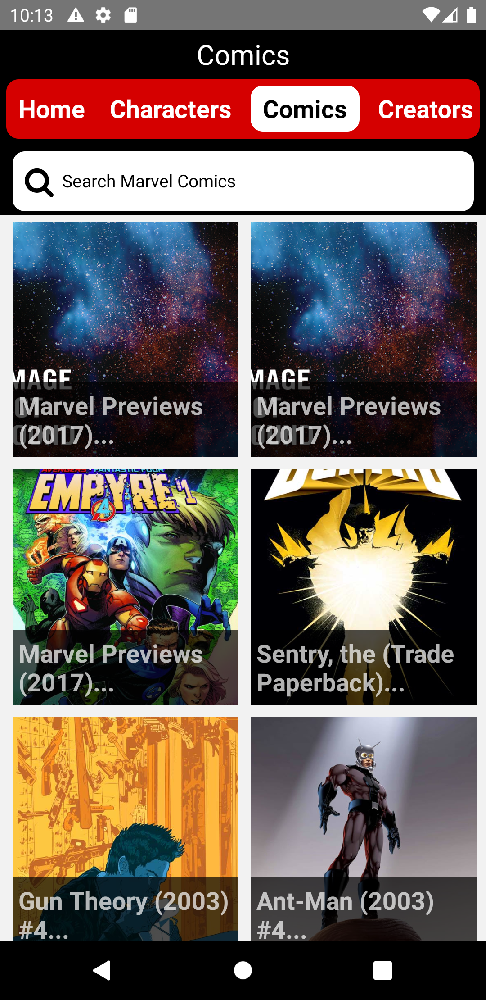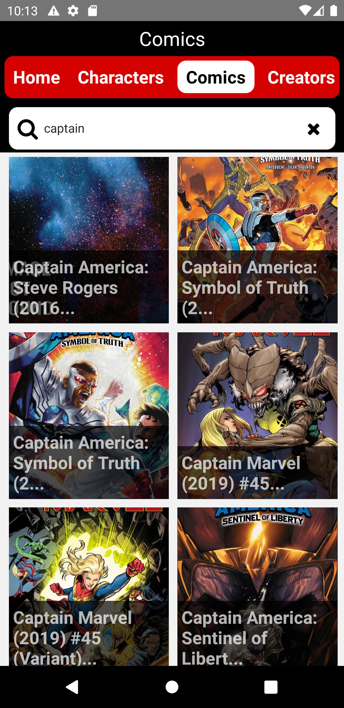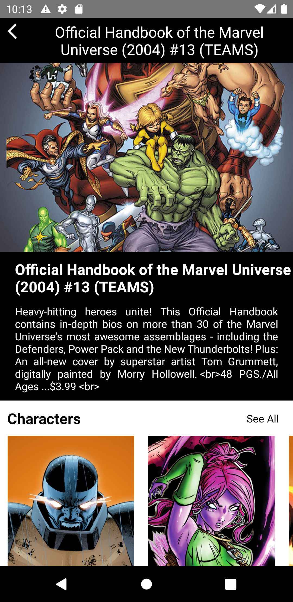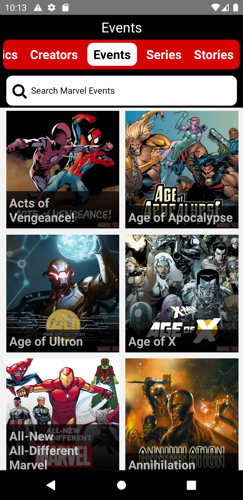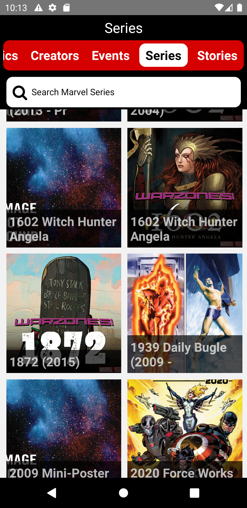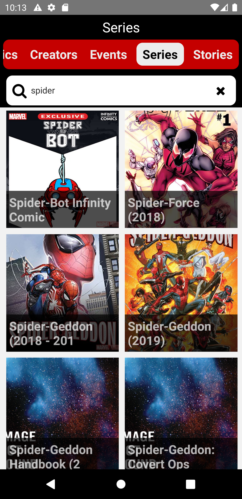

## Tools & Resources

- React-navigation
- axios
- React Native Firebase auth
- React-Native-vector-icons
- formik
- react-native-flash-message
- yup
