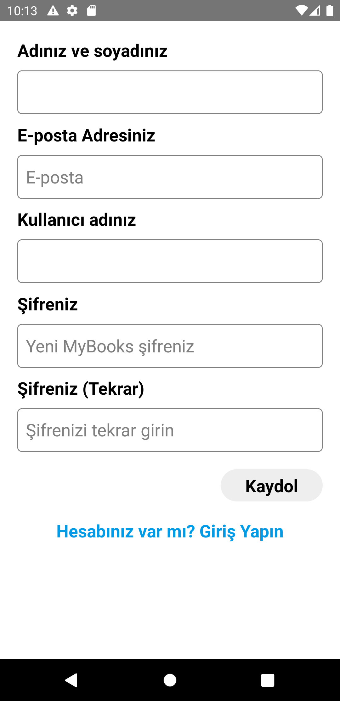

### MyBooks

#### Started Page

#### Search page,book info page, selected book page

#### User profile , other user profile

#### read book,reading book,favori book

#### book shelves

#### book shelves

## Tools & Resources

- React-navigation
- axios
- React Native Firebase auth
- React Native Firebase Real-Time-database
- React-Native-vector-icons
- react-native-modal
- date-fns
- formik
- react-native-flash-message
- react-native-image-picker
- yup
