### Trivia

#### Started Page,Home Page,Categories,Question

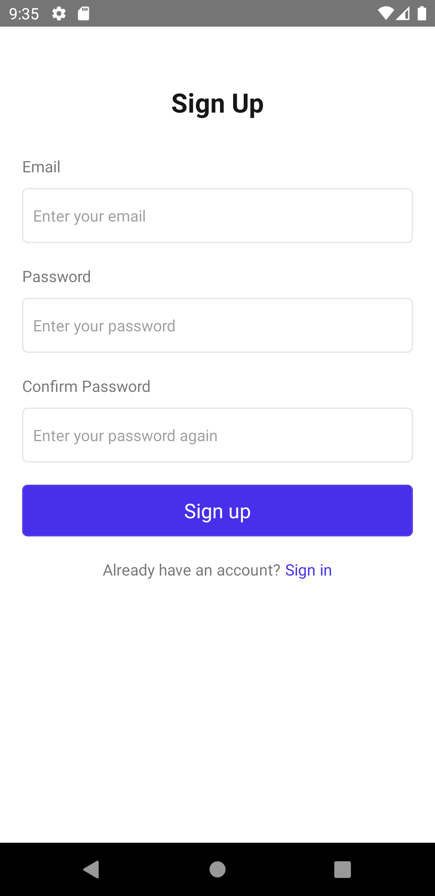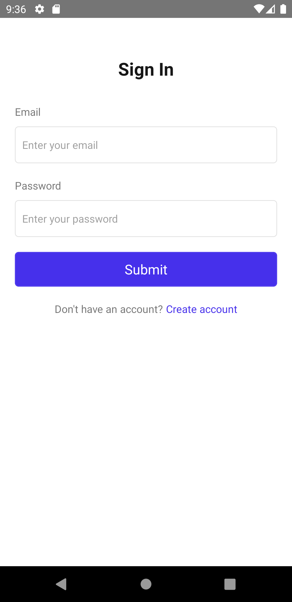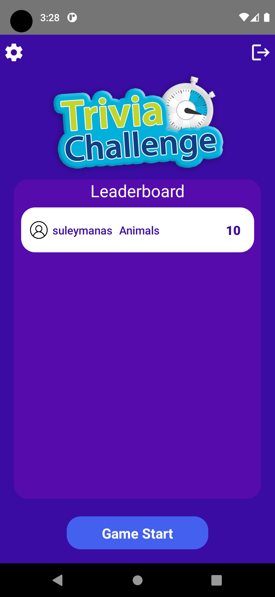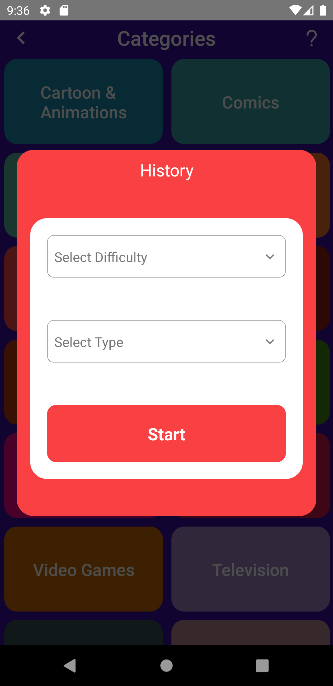

#### Question Page

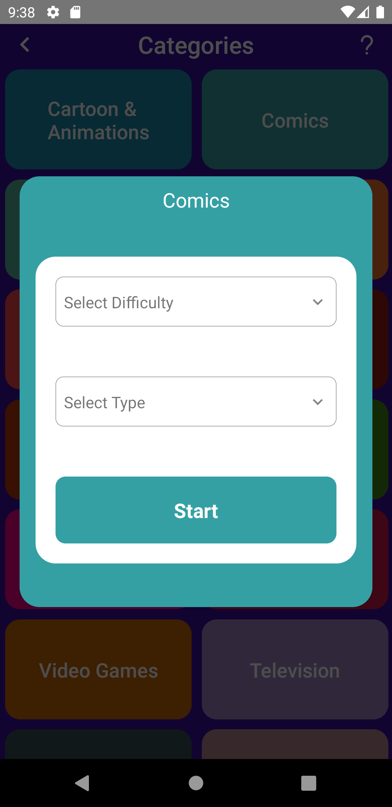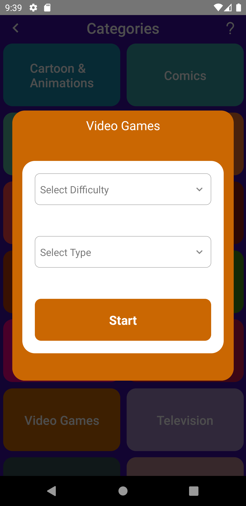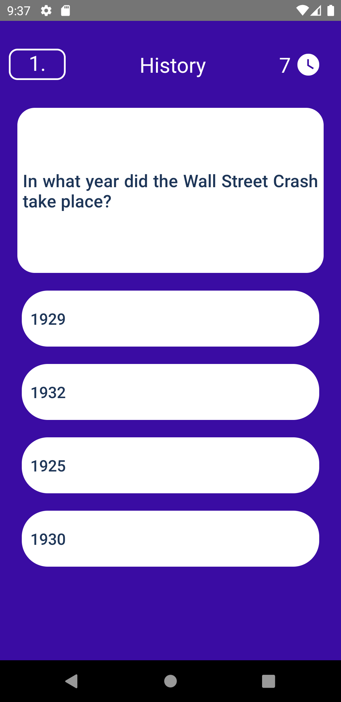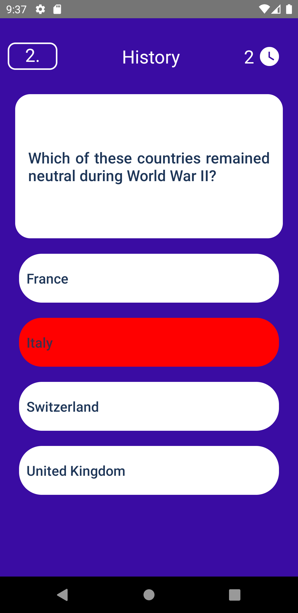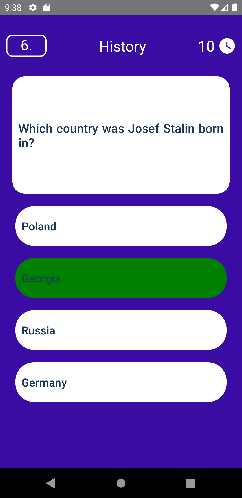

#### Results Page

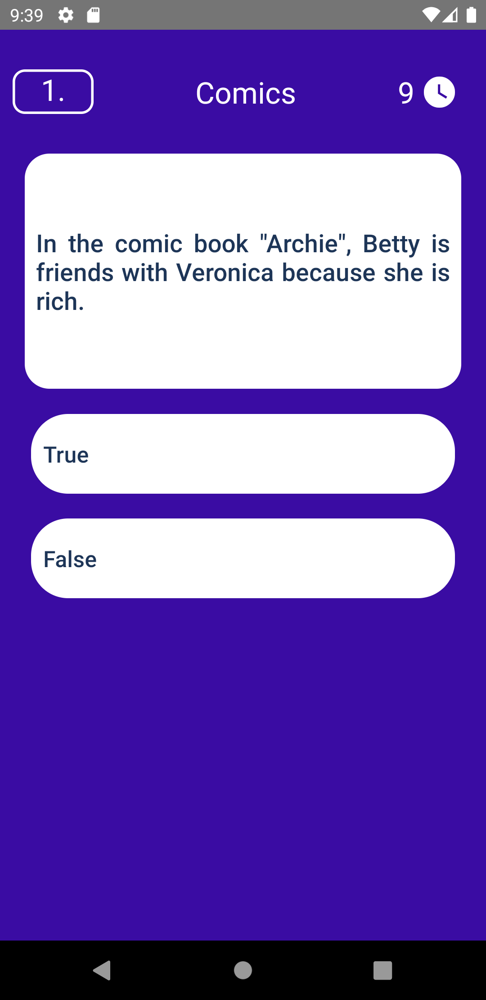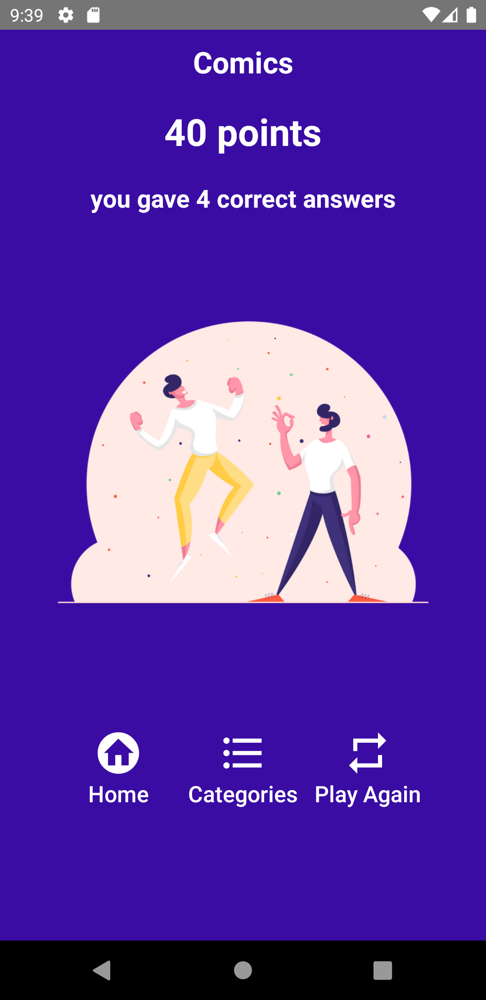

## Tools & Resources

- React-navigation
- React Native Firebase auth
- React Native Firebase database
- React-Native-vector-icons
- React-Native-Modal
- React-Native-Element-Dropdown

