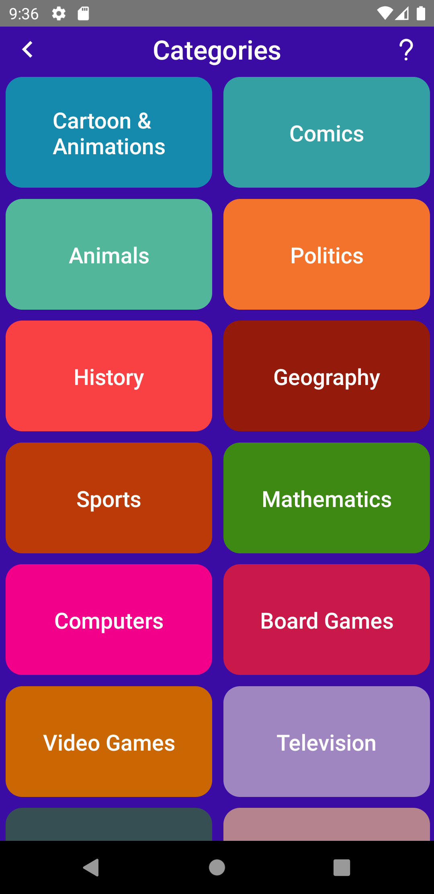

### Trivia

#### Started Page,Home Page,Categories,Question

#### Question Page

#### Results Page

## Tools & Resources

- React-navigation
- React Native Firebase auth
- React Native Firebase database
- React-Native-vector-icons
- React-Native-Modal
- React-Native-Element-Dropdown

